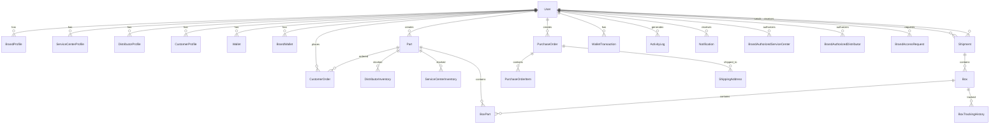

# SpareFlow - Database Schema Documentation

## Table of Contents
1. [Overview](#overview)
2. [Entity Relationship Diagram](#entity-relationship-diagram)
3. [Core Tables](#core-tables)
4. [Authorization Tables](#authorization-tables)
5. [Financial Tables](#financial-tables)
6. [Logistics Tables](#logistics-tables)
7. [Inventory Tables](#inventory-tables)
8. [System Tables](#system-tables)
9. [Indexes and Performance](#indexes-and-performance)
10. [Data Migration Scripts](#data-migration-scripts)

## Overview

The SpareFlow database is built on PostgreSQL and uses Prisma ORM for type-safe database operations. The schema supports multi-tenant architecture with role-based access control.

### Database Configuration
- **Database**: PostgreSQL 14+
- **ORM**: Prisma 5.22.0
- **Connection Pooling**: Prisma Accelerate
- **Migrations**: Prisma Migrate

## Entity Relationship Diagram



## Core Tables

### users
Central user management table supporting all user roles.

```sql
CREATE TABLE users (
    id TEXT PRIMARY KEY,
    name TEXT NOT NULL,
    email TEXT UNIQUE NOT NULL,
    password TEXT NOT NULL,
    role user_role NOT NULL,
    phone TEXT,
    created_at TIMESTAMP DEFAULT NOW(),
    updated_at TIMESTAMP DEFAULT NOW()
);

-- Enum for user roles
CREATE TYPE user_role AS ENUM (
    'SUPER_ADMIN',
    'BRAND',
    'DISTRIBUTOR', 
    'SERVICE_CENTER',
    'CUSTOMER'
);
```

**Key Fields:**
- `id`: CUID primary key
- `email`: Unique identifier for authentication
- `role`: Determines access permissions and dashboard type
- `password`: bcrypt hashed password

**Relationships:**
- One-to-one with profile tables based on role
- One-to-many with shipments, orders, parts
- Many-to-many with authorization tables

### parts
Product catalog with enhanced metadata for spare parts.

```sql
CREATE TABLE parts (
    id TEXT PRIMARY KEY,
    code TEXT UNIQUE NOT NULL,
    name TEXT NOT NULL,
    description TEXT,
    weight DECIMAL,
    price DECIMAL NOT NULL,
    msl INTEGER, -- Moisture Sensitivity Level
    brand_id TEXT NOT NULL REFERENCES users(id),
    diy_video_url TEXT,
    image_url TEXT,
    image_urls TEXT, -- JSON array
    length DECIMAL, -- cm
    breadth DECIMAL, -- cm
    height DECIMAL, -- cm
    category TEXT,
    sub_category TEXT,
    tags TEXT, -- JSON array
    specifications TEXT, -- JSON object
    warranty INTEGER, -- months
    is_active BOOLEAN DEFAULT TRUE,
    featured BOOLEAN DEFAULT FALSE,
    seo_title TEXT,
    seo_description TEXT,
    created_at TIMESTAMP DEFAULT NOW(),
    updated_at TIMESTAMP DEFAULT NOW()
);
```

**Key Fields:**
- `code`: Unique part identifier
- `brand_id`: Foreign key to brand user
- `price`: Current selling price
- `weight`: Used for shipping calculations
- `dimensions`: Length, breadth, height for shipping
- `specifications`: JSON object for technical details

**Indexes:**
```sql
CREATE INDEX idx_parts_brand_id ON parts(brand_id);
CREATE INDEX idx_parts_code ON parts(code);
CREATE INDEX idx_parts_category ON parts(category);
CREATE INDEX idx_parts_brand_active ON parts(brand_id, is_active);
```

## Authorization Tables

### brand_authorized_service_centers
Manages brand-service center relationships.

```sql
CREATE TABLE brand_authorized_service_centers (
    id TEXT PRIMARY KEY,
    brand_id TEXT NOT NULL REFERENCES users(id) ON DELETE CASCADE,
    service_center_user_id TEXT NOT NULL REFERENCES users(id) ON DELETE CASCADE,
    status TEXT DEFAULT 'Active', -- Active/Inactive
    created_at TIMESTAMP DEFAULT NOW(),
    
    UNIQUE(brand_id, service_center_user_id)
);
```

### brand_authorized_distributors
Manages brand-distributor relationships.

```sql
CREATE TABLE brand_authorized_distributors (
    id TEXT PRIMARY KEY,
    brand_id TEXT NOT NULL REFERENCES users(id) ON DELETE CASCADE,
    distributor_user_id TEXT NOT NULL REFERENCES users(id) ON DELETE CASCADE,
    status TEXT DEFAULT 'Active', -- Active/Inactive
    created_at TIMESTAMP DEFAULT NOW(),
    
    UNIQUE(brand_id, distributor_user_id)
);
```

### brand_access_requests
Handles access requests from service centers and distributors.

```sql
CREATE TABLE brand_access_requests (
    request_id TEXT PRIMARY KEY,
    user_id TEXT NOT NULL REFERENCES users(id) ON DELETE CASCADE,
    role_type access_request_role_type NOT NULL,
    brand_id TEXT NOT NULL REFERENCES users(id) ON DELETE CASCADE,
    message TEXT,
    document_url TEXT,
    status access_request_status DEFAULT 'PENDING',
    handled_by_admin_id TEXT REFERENCES users(id),
    created_at TIMESTAMP DEFAULT NOW(),
    updated_at TIMESTAMP DEFAULT NOW()
);

CREATE TYPE access_request_role_type AS ENUM ('SERVICE_CENTER', 'DISTRIBUTOR');
CREATE TYPE access_request_status AS ENUM ('PENDING', 'APPROVED', 'REJECTED');
```

## Financial Tables

### wallets
General wallet system for all user types.

```sql
CREATE TABLE wallets (
    id TEXT PRIMARY KEY,
    user_id TEXT UNIQUE NOT NULL REFERENCES users(id),
    balance DECIMAL DEFAULT 0,
    total_earned DECIMAL DEFAULT 0,
    total_spent DECIMAL DEFAULT 0,
    last_recharge TIMESTAMP,
    created_at TIMESTAMP DEFAULT NOW(),
    updated_at TIMESTAMP DEFAULT NOW()
);
```

### brand_wallets
Specialized wallet for brand users with additional features.

```sql
CREATE TABLE brand_wallets (
    id TEXT PRIMARY KEY,
    brand_id TEXT UNIQUE NOT NULL REFERENCES users(id),
    balance DECIMAL DEFAULT 0,
    total_spent DECIMAL DEFAULT 0,
    last_recharge TIMESTAMP,
    created_at TIMESTAMP DEFAULT NOW(),
    updated_at TIMESTAMP DEFAULT NOW()
);
```

### wallet_transactions
All financial transactions across the platform.

```sql
CREATE TABLE wallet_transactions (
    id TEXT PRIMARY KEY,
    user_id TEXT NOT NULL REFERENCES users(id),
    type wallet_transaction_type NOT NULL,
    amount DECIMAL NOT NULL,
    description TEXT NOT NULL,
    purchase_order_id TEXT REFERENCES purchase_orders(id),
    balance_after DECIMAL NOT NULL,
    status TEXT DEFAULT 'COMPLETED', -- COMPLETED, PENDING, FAILED
    created_at TIMESTAMP DEFAULT NOW()
);

CREATE TYPE wallet_transaction_type AS ENUM ('CREDIT', 'DEBIT');
```

### margin_logs
Tracks profit margins on shipments and orders.

```sql
CREATE TABLE margin_logs (
    id TEXT PRIMARY KEY,
    shipment_id TEXT REFERENCES shipments(id),
    box_id TEXT REFERENCES boxes(id),
    customer_order_id TEXT REFERENCES customer_orders(id),
    brand_id TEXT NOT NULL REFERENCES users(id),
    customer_price DECIMAL NOT NULL, -- What customer paid (Y)
    dtdc_cost DECIMAL NOT NULL, -- What DTDC charged (X)
    margin DECIMAL NOT NULL, -- Y - X
    margin_percent DECIMAL NOT NULL, -- Percentage
    awb_number TEXT,
    weight DECIMAL,
    service_type TEXT,
    origin TEXT,
    destination TEXT,
    calculated_at TIMESTAMP DEFAULT NOW(),
    notes TEXT
);
```

## Logistics Tables

### shipments
Main shipment tracking table.

```sql
CREATE TABLE shipments (
    id TEXT PRIMARY KEY,
    brand_id TEXT NOT NULL REFERENCES users(id),
    service_center_id TEXT NOT NULL REFERENCES users(id),
    num_boxes INTEGER NOT NULL,
    status shipment_status DEFAULT 'INITIATED',
    created_at TIMESTAMP DEFAULT NOW(),
    updated_at TIMESTAMP DEFAULT NOW()
);

CREATE TYPE shipment_status AS ENUM ('INITIATED', 'DISPATCHED', 'DELIVERED');
```

### boxes
Individual shipping units within shipments.

```sql
CREATE TABLE boxes (
    id TEXT PRIMARY KEY,
    shipment_id TEXT NOT NULL REFERENCES shipments(id) ON DELETE CASCADE,
    box_number TEXT NOT NULL,
    awb_number TEXT,
    weight DECIMAL,
    status box_status DEFAULT 'PENDING',
    customer_price DECIMAL, -- What customer paid
    dtdc_cost DECIMAL, -- What DTDC charged
    margin DECIMAL, -- Calculated margin
    margin_percent DECIMAL, -- Margin percentage
    created_at TIMESTAMP DEFAULT NOW(),
    updated_at TIMESTAMP DEFAULT NOW()
);

CREATE TYPE box_status AS ENUM ('PENDING', 'IN_TRANSIT', 'DELIVERED');
```

### box_tracking_history
Detailed tracking history for each box.

```sql
CREATE TABLE box_tracking_history (
    id TEXT PRIMARY KEY,
    box_id TEXT NOT NULL REFERENCES boxes(id) ON DELETE CASCADE,
    awb_number TEXT NOT NULL,
    scan_code TEXT,
    status TEXT NOT NULL,
    location TEXT,
    timestamp TIMESTAMP NOT NULL,
    description TEXT,
    created_at TIMESTAMP DEFAULT NOW()
);
```

### box_parts
Junction table linking boxes to parts.

```sql
CREATE TABLE box_parts (
    id TEXT PRIMARY KEY,
    box_id TEXT NOT NULL REFERENCES boxes(id) ON DELETE CASCADE,
    part_id TEXT NOT NULL REFERENCES parts(id),
    quantity INTEGER NOT NULL,
    created_at TIMESTAMP DEFAULT NOW(),
    updated_at TIMESTAMP DEFAULT NOW()
);
```

## Inventory Tables

### distributor_inventory
Inventory management for distributors.

```sql
CREATE TABLE distributor_inventory (
    id TEXT PRIMARY KEY,
    distributor_id TEXT NOT NULL REFERENCES users(id),
    part_id TEXT NOT NULL REFERENCES parts(id),
    current_stock INTEGER NOT NULL,
    min_stock_level INTEGER NOT NULL,
    max_stock_level INTEGER NOT NULL,
    unit_price DECIMAL NOT NULL,
    last_restocked TIMESTAMP NOT NULL,
    created_at TIMESTAMP DEFAULT NOW(),
    updated_at TIMESTAMP DEFAULT NOW(),
    
    UNIQUE(distributor_id, part_id)
);
```

### service_center_inventory
Inventory management for service centers.

```sql
CREATE TABLE service_center_inventory (
    id TEXT PRIMARY KEY,
    service_center_profile_id TEXT NOT NULL REFERENCES service_center_profiles(id),
    part_id TEXT NOT NULL REFERENCES parts(id),
    current_stock INTEGER NOT NULL,
    min_stock_level INTEGER NOT NULL,
    max_stock_level INTEGER NOT NULL,
    unit_cost DECIMAL NOT NULL,
    last_restocked TIMESTAMP,
    last_consumed TIMESTAMP,
    location TEXT, -- Storage location
    notes TEXT,
    created_at TIMESTAMP DEFAULT NOW(),
    updated_at TIMESTAMP DEFAULT NOW(),
    
    UNIQUE(service_center_profile_id, part_id)
);
```

### inventory_consumption
Tracks inventory usage at service centers.

```sql
CREATE TABLE inventory_consumption (
    id TEXT PRIMARY KEY,
    service_center_inventory_id TEXT NOT NULL REFERENCES service_center_inventory(id),
    quantity INTEGER NOT NULL,
    reason TEXT NOT NULL, -- REPAIR, MAINTENANCE, REPLACEMENT
    customer_info TEXT,
    job_number TEXT,
    notes TEXT,
    consumed_at TIMESTAMP DEFAULT NOW(),
    created_at TIMESTAMP DEFAULT NOW()
);
```

## System Tables

### system_settings
Configuration management.

```sql
CREATE TABLE system_settings (
    id TEXT PRIMARY KEY,
    key TEXT UNIQUE NOT NULL,
    value TEXT NOT NULL,
    description TEXT,
    created_at TIMESTAMP DEFAULT NOW(),
    updated_at TIMESTAMP DEFAULT NOW()
);
```

### activity_logs
User activity tracking.

```sql
CREATE TABLE activity_logs (
    id TEXT PRIMARY KEY,
    user_id TEXT NOT NULL REFERENCES users(id),
    action TEXT NOT NULL,
    details TEXT, -- JSON string
    ip_address TEXT,
    user_agent TEXT,
    created_at TIMESTAMP DEFAULT NOW()
);
```

### notifications
User notification system.

```sql
CREATE TABLE notifications (
    id TEXT PRIMARY KEY,
    user_id TEXT NOT NULL REFERENCES users(id),
    title TEXT NOT NULL,
    message TEXT NOT NULL,
    type TEXT NOT NULL,
    related_id TEXT,
    is_read BOOLEAN DEFAULT FALSE,
    created_at TIMESTAMP DEFAULT NOW()
);
```

## Indexes and Performance

### Primary Indexes
```sql
-- User-related indexes
CREATE INDEX idx_users_email ON users(email);
CREATE INDEX idx_users_role ON users(role);
CREATE INDEX idx_users_created_at ON users(created_at);

-- Parts indexes
CREATE INDEX idx_parts_brand_id ON parts(brand_id);
CREATE INDEX idx_parts_code ON parts(code);
CREATE INDEX idx_parts_category ON parts(category);
CREATE INDEX idx_parts_brand_active ON parts(brand_id, is_active);
CREATE INDEX idx_parts_featured ON parts(featured) WHERE featured = true;

-- Shipment indexes
CREATE INDEX idx_shipments_brand_id ON shipments(brand_id);
CREATE INDEX idx_shipments_service_center_id ON shipments(service_center_id);
CREATE INDEX idx_shipments_status ON shipments(status);
CREATE INDEX idx_shipments_created_at ON shipments(created_at);
CREATE INDEX idx_shipments_brand_service ON shipments(brand_id, service_center_id);

-- Box indexes
CREATE INDEX idx_boxes_shipment_id ON boxes(shipment_id);
CREATE INDEX idx_boxes_awb_number ON boxes(awb_number);
CREATE INDEX idx_boxes_status ON boxes(status);

-- Tracking indexes
CREATE INDEX idx_tracking_box_id ON box_tracking_history(box_id);
CREATE INDEX idx_tracking_awb_number ON box_tracking_history(awb_number);
CREATE INDEX idx_tracking_timestamp ON box_tracking_history(timestamp);

-- Financial indexes
CREATE INDEX idx_wallet_transactions_user_id ON wallet_transactions(user_id);
CREATE INDEX idx_wallet_transactions_type ON wallet_transactions(type);
CREATE INDEX idx_wallet_transactions_created_at ON wallet_transactions(created_at);

-- Authorization indexes
CREATE INDEX idx_brand_service_centers_brand_id ON brand_authorized_service_centers(brand_id);
CREATE INDEX idx_brand_distributors_brand_id ON brand_authorized_distributors(brand_id);
CREATE INDEX idx_access_requests_brand_id ON brand_access_requests(brand_id);
CREATE INDEX idx_access_requests_user_id ON brand_access_requests(user_id);
CREATE INDEX idx_access_requests_status ON brand_access_requests(status);
```

### Composite Indexes for Complex Queries
```sql
-- Multi-column indexes for common query patterns
CREATE INDEX idx_parts_search ON parts(brand_id, category, is_active);
CREATE INDEX idx_shipments_status_date ON shipments(status, created_at);
CREATE INDEX idx_inventory_distributor_stock ON distributor_inventory(distributor_id, current_stock);
CREATE INDEX idx_notifications_user_read ON notifications(user_id, is_read);
```

## Data Migration Scripts

### Initial Setup
```sql
-- Create extensions
CREATE EXTENSION IF NOT EXISTS "uuid-ossp";

-- Create enums
CREATE TYPE user_role AS ENUM ('SUPER_ADMIN', 'BRAND', 'DISTRIBUTOR', 'SERVICE_CENTER', 'CUSTOMER');
CREATE TYPE shipment_status AS ENUM ('INITIATED', 'DISPATCHED', 'DELIVERED');
CREATE TYPE box_status AS ENUM ('PENDING', 'IN_TRANSIT', 'DELIVERED');
CREATE TYPE wallet_transaction_type AS ENUM ('CREDIT', 'DEBIT');
CREATE TYPE access_request_status AS ENUM ('PENDING', 'APPROVED', 'REJECTED');
CREATE TYPE access_request_role_type AS ENUM ('SERVICE_CENTER', 'DISTRIBUTOR');
```

### Sample Data Insertion
```sql
-- Insert default super admin
INSERT INTO users (id, name, email, password, role) VALUES 
('admin_001', 'Super Admin', 'admin@spareflow.com', '$2a$12$hashed_password', 'SUPER_ADMIN');

-- Insert system settings
INSERT INTO system_settings (id, key, value, description) VALUES 
('setting_001', 'DEFAULT_SHIPPING_RATE', '50.00', 'Default shipping rate per box'),
('setting_002', 'WALLET_MIN_BALANCE', '100.00', 'Minimum wallet balance required'),
('setting_003', 'MAX_BOXES_PER_SHIPMENT', '50', 'Maximum boxes allowed per shipment');

-- Insert default pricing rules
INSERT INTO role_based_pricing (id, role, base_rate, multiplier, is_active) VALUES 
('pricing_001', 'BRAND', 45.00, 1.0, true),
('pricing_002', 'DISTRIBUTOR', 50.00, 1.1, true),
('pricing_003', 'SERVICE_CENTER', 55.00, 1.2, true);
```

### Data Cleanup Scripts
```sql
-- Clean up old tracking data (older than 6 months)
DELETE FROM box_tracking_history 
WHERE created_at < NOW() - INTERVAL '6 months';

-- Clean up old activity logs (older than 3 months)
DELETE FROM activity_logs 
WHERE created_at < NOW() - INTERVAL '3 months';

-- Clean up read notifications (older than 1 month)
DELETE FROM notifications 
WHERE is_read = true AND created_at < NOW() - INTERVAL '1 month';
```

### Performance Optimization
```sql
-- Analyze tables for query optimization
ANALYZE users;
ANALYZE parts;
ANALYZE shipments;
ANALYZE boxes;
ANALYZE wallet_transactions;

-- Update table statistics
UPDATE pg_stat_user_tables SET n_tup_ins = 0, n_tup_upd = 0, n_tup_del = 0;

-- Vacuum tables to reclaim space
VACUUM ANALYZE users;
VACUUM ANALYZE parts;
VACUUM ANALYZE shipments;
```

This database schema provides a robust foundation for the SpareFlow platform with proper normalization, indexing, and performance optimization strategies.